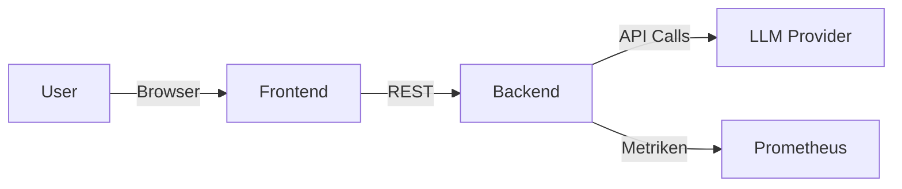

# Projektplan HBVGPT Service-Erweiterung

## 1. Einleitung
HBVGPT ist ein KI-basierter Chat-Assistent, der bereits verschiedene Anwendungsfaelle wie Summaries, Quizzes und freie Prompts abdeckt. Das Ziel dieses Projektplans ist es, die Entwicklung und Implementierung eines erweiterten Service-Ansatzes zu beschreiben, der das bestehende System in eine umfassende Servicearchitektur ueberfuehrt. Dabei werden alle Schritte von der Anforderungsanalyse bis zum prototypischen Aufbau dokumentiert. Dieser Plan dient als Leitfaden und Dokumentationsbasis fuer das Projektteam.

## 2. Projektueberblick
- **Projektname:** HBVGPT Service-Erweiterung
- **Projektziel:** Bereitstellung eines modularen, wiederverwendbaren Services, der KI-gestuetzte Funktionen ueber standardisierte Schnittstellen verfuegbar macht
- **Endtermin:** 23. April (fertiger Prototyp mit Dokumentation)
- **Beteiligte Stakeholder:** Projektteam, interne Auftraggeber, potenzielle Benutzer (IT-Services-Team), LLM-Anbieter

## 3. Service Definition
Hier wird festgelegt, welcher Service implementiert werden soll, wie er aufgebaut ist und welche Funktionen er bietet.

### 3.1 Zielsetzung des Services
Der geplante Service "HBVGPT Service API" soll verschiedene KI-Funktionen ueber klar definierte Endpunkte zur Verfuegung stellen. Unternehmen koennen diese Funktionen (z. B. Zusammenfassungen, Quiz-Generierung, Wissensabfragen) in eigene Anwendungen integrieren. Dadurch wird HBVGPT nicht nur als Weboberflaeche, sondern auch als eigenstaendiger Backend-Service nutzbar.

### 3.2 Funktionaler Umfang
1. **Summarization-Service**
   - Endpunkt `/api/summary`
   - Parameter: Text, gewuenschte Laenge, Modell/Provider
   - Output: Zusammenfassung im JSON-Format
2. **Quiz-Service**
   - Endpunkt `/api/quiz`
   - Parameter: Topic, optional Kontext, Modell/Provider
   - Output: Liste von Fragen/Antworten
3. **FreePrompt-Service**
   - Endpunkt `/api/prompt`
   - Parameter: Beliebiger Prompt, optional Chat-History
   - Output: Freitext-Antwort
4. **FunFact-Service**
   - Endpunkt `/api/funfact`
   - Parameter: Thema oder Wort
   - Output: Kurzer Fakt mit Quellenangabe

### 3.3 Technische Architektur
- **Backend:** FastAPI (Python 3.11)
- **LLM-Anbindung:** ueber LangChain (OpenAI, Groq)
- **Frontend:** Optionales Vue 3 Interface (bestehend), fuer das Service-Backend jedoch nicht zwingend erforderlich
- **Containerisierung:** Docker & Docker Compose
- **Monitoring:** Prometheus als Metrik-Backend
- **Persistenz (optional):** OpenSearch bzw. andere Datenbanken zur Speicherung von Feedback und Nutzungsdaten

### 3.4 Service-Aufruf und Orchestrierung
Der Service soll so aufgebaut sein, dass er mehrere Aufrufe kombinieren kann. Beispielsweise kann ein Geschaeftsprozess aus den folgenden Schritten bestehen:
1. Benutzer uebermittelt ein Dokument
2. Service generiert zunaechst eine Zusammenfassung
3. Anschliessend wird ein thematisches Quiz erzeugt
4. Ergebnisse werden gemeinsam bereitgestellt und an den Benutzer ausgegeben

Diese Kombination soll ueber Workflows realisierbar sein, die sich spaeter erweitern lassen (z. B. automatisches Nachschlagen von Fakten, Sentiment-Analyse etc.).

## 4. Anforderungsanalyse (Requirements Engineering)
Eine solide Anforderungsanalyse ist entscheidend fuer den Projekterfolg. Hier werden die Anforderungen systematisch erhoben, priorisiert und dokumentiert.

### 4.1 Stakeholder-Analyse
- **Projektteam / Entwickler:** Implementierung, Tests, Wartung
- **Management / Auftraggeber:** Investitionsentscheidungen, Zielvorgaben
- **Endanwender (Unternehmen, interne Abteilungen):** Nutzen die Service-Schnittstellen fuer eigene Prozesse
- **LLM-Anbieter:** Bereitstellung der Modelle, API-Richtlinien
- **Datenschutzbeauftragte:** Sicherstellen von Compliance und Datenschutz

### 4.2 Erhebungsmethoden
- Interviews mit Stakeholdern
- Analyse bestehender Dokumentation (READMEs, Code, Kommentare)
- Konkurrenzanalyse: Wie loesen andere Anbieter aehnliche Aufgaben?
- Workshops und Brainstorming-Sessions

### 4.3 Funktionale Anforderungen
1. **FA1**: Der Service muss ueber REST-APIs verfuegbar sein und JSON nutzen
2. **FA2**: Es muss moeglich sein, verschiedene LLM-Anbieter (OpenAI, Groq, ggf. weitere) auszuwaehlen
3. **FA3**: Der Service muss Eingaben validieren und sichere Prompts erstellen (Prompt-Hardening)
4. **FA4**: Ergebnisse sollen nach Bedarf zusammengefasst, als Quiz oder als Freitext bereitgestellt werden
5. **FA5**: Feedback muss gespeichert und ausgewertet werden koennen
6. **FA6**: Kombination von Services in einem Prozess muss moeglich sein (z. B. Summarize + Quiz)

### 4.4 Nichtfunktionale Anforderungen
1. **NFA1**: Reaktionszeit unter 5 Sekunden fuer Standardanfragen (abhaengig vom LLM)
2. **NFA2**: Hoehere Zuverlaessigkeit durch Monitoring (Prometheus)
3. **NFA3**: Skalierbarkeit via Docker (spaeter Kubernetes)
4. **NFA4**: Einhaltung von Datenschutzrichtlinien (kein Speichern sensibler Nutzerdaten ohne Zustimmung)
5. **NFA5**: Gute Dokumentation (API-Referenz, Beispiele, Entwicklerhandbuch)

### 4.5 Abgrenzung
- Persistente Speicherung komplexer Daten ist nicht Teil des ersten Prototyps
- Kein ausgefeilter Authentifizierungsmechanismus im MVP (spaeter moeglich)
- Keine garantierte Offline-Nutzung (LLM-Anbindung benoetigt Internet)

### 4.6 Priorisierung
- Hohe Prioritaet: Grundfunktionen (FA1-FA4), Reaktionszeit (NFA1)
- Mittlere Prioritaet: Feedback-Speicherung (FA5), Monitoring (NFA2)
- Niedrige Prioritaet: Prozesskette (FA6) und Skalierung (NFA3) im ersten Release

## 5. Projektmeilensteine und Zeitplan
Ein klarer Zeitplan mit Meilensteinen sorgt fuer Transparenz. Der letzte Termin fuer den lauffaehigen Prototypen ist der **23. April**. Die folgenden Etappen sind vorgesehen:

| Nr. | Datum | Meilenstein | Ergebnis |
|-----|-------|-------------|----------|
| 1 | 01. Maerz | Projektstart, Kick-off | Projektteam gebildet, Ziele geklaert |
| 2 | 10. Maerz | Abschluss Anforderungsanalyse | Dokumentierte Anforderungen (siehe Abschnitt 4) |
| 3 | 20. Maerz | Architektur- und Service-Design | Entwurf Service-Schnittstellen, Modellierung |
| 4 | 05. April | Implementation Grundfunktionen | REST-Endpunkte umgesetzt, LLM-Anbindung funktionsfaehig |
| 5 | 12. April | Integration & Testphase | Funktionstests, evtl. Lasttests |
| 6 | 18. April | Erweiterte Funktionen (Feedback, Prozessketten) | Zusaetzliche Features integriert |
| 7 | 23. April | Abschluss Prototyp & Dokumentation | Vollstaendiger Prototyp, alle Dokumente, Demo |
| 8 | 25. April | Nachbesprechung & Lessons Learned | Optional, Review des Projekts |

Diese Tabelle zeigt eine grobe Planung; je nach Umfang koennen einzelne Schritte angepasst werden.

## 6. Design und Modell des Services
Das Design gliedert sich in mehrere Ebenen: die technische Architektur, die Prozessmodellierung und die Schnittstellendefinition.

### 6.1 Architekturueberblick
Das System besteht aus drei Hauptkomponenten:
1. **Frontend (optional):** Das bestehende Vue-Interface aus dem Repository, fuer Endnutzer interaktiv.
2. **Service-Backend:** Neue, modulare API-Schicht auf Basis von FastAPI.
3. **LLM-Provider:** Externe Dienste wie Groq oder OpenAI, ueber LangChain abstrahiert.

Dazwischen koennen optionale Services wie Monitoring oder Persistenz geschaltet werden. Das folgende Diagramm verdeutlicht die grobe Architektur (Pseudo-Diagramm):



Der Fokus liegt auf dem Backend, das eine stabile Schnittstelle zu den LLMs bietet und Eingaben entsprechend verarbeitet.

### 6.2 Datenmodell
Die API kommuniziert hauptsaechlich per JSON. Beispiel fuer die Struktur des Quiz-Services:

```json
{
  "topic": "Kunstgeschichte",
  "questions": [
    { "question": "Wer malte die Mona Lisa?", "answer": "Leonardo da Vinci" },
    { "question": "Wann begann die Renaissance?", "answer": "Im 14. Jahrhundert" }
  ]
}
```

Fuer Feedback koennte ein eigenes Schema genutzt werden:

```json
{
  "id": "uuid",
  "timestamp": "2024-04-01T12:00:00Z",
  "thumbs": "up",
  "message_index": 2,
  "model": "gemma2-9b-it",
  "provider": "groq"
}
```

### 6.3 Prozessmodell
Ein moeglicher Geschaeftsprozess koennte so aussehen:
1. Anwender sendet Dokument an `/api/summary`
2. Backend analysiert Text, erstellt Zusammenfassung
3. Mit demselben Text wird `/api/quiz` aufgerufen
4. Ergebnisse werden kombiniert und dem Anwender bereitgestellt
5. Anwender gibt Feedback, das gespeichert wird

Dieser Ablauf laesst sich spaeter erweitern, etwa mit zusaetzlicher Recherche oder automatischer Formatierung.

### 6.4 Schnittstellen und Endpunkte
- **POST `/api/summary`**: Nimmt `text` und `length` entgegen, liefert JSON mit zusammengefasstem Inhalt.
- **POST `/api/quiz`**: Nimmt `topic`/`context`, liefert Quizfragen.
- **POST `/api/prompt`**: Allgemeines Prompt, gibt freien Text zurueck.
- **POST `/api/funfact`**: Liefert kurzen Fakt zu einem Begriff.

Erweiterungen koennten folgende Endpunkte abdecken:
- **`/api/process_chain`**: Kombination mehrerer Aktionen in einem Call.
- **`/api/feedback`**: Speichert Rueckmeldungen persistiert.

### 6.5 Technologie-Stack und Bibliotheken
1. **FastAPI** fuer HTTP-Endpoints
2. **LangChain** fuer Prompt-Management und LLM-Ketten
3. **Docker** zur Containerisierung
4. **OpenSearch** (optional) fuer Persistenz
5. **Prometheus** fuer Monitoring

## 7. Prototypische Implementierung
Auf Grundlage des Designs erfolgt eine schrittweise Implementierung:

### 7.1 Vorbereitungsphase
- Repository clonen, Grundstruktur pruefen
- `.env` mit API-Schluesseln anlegen (z. B. fuer Groq, OpenAI)
- Lokales Docker-Setup testen (`docker-compose up`)

### 7.2 Implementierung der Services
1. **Grundlegende API-Struktur**
   - Anlegen neuer FastAPI-Routen in `main.py` oder separatem Modul
   - Nutzung von Pydantic fuer Request- und Response-Modelle
2. **Integration der LLM-Aufrufe**
   - Erweiterung von `chains.py`, um Parameter fuer Summary, Quiz usw. zu verarbeiten
   - Fehlerbehandlung und Timeout-Strategien
3. **Feedback-Speicherung**
   - Einfacher Speicher (z. B. JSON-Datei oder OpenSearch)
4. **Prozessketten**
   - Beispiel-Workflow implementieren: Aufruf von `/api/summary` und danach `/api/quiz`
   - Ergebnisse kombinieren und zurueckgeben

### 7.3 Testphase
- Manuelle Aufrufe der API-Endpunkte
- Validierung der Eingaben und Antworten (Parser, JSON-Schema)
- Performance-Tests (z. B. 100 Anfragen nacheinander)
- Monitoring aktivieren und Metriken pruefen

### 7.4 Deployment
- Docker-Image bauen und in Container-Registry ablegen
- Ausrollen auf Testserver oder interner Cloud-Umgebung

## 8. Dokumentation der Vorgehensweise und Ergebnisse
Die Dokumentation begleitet alle Phasen:
1. **Projektsetup**: README, Installationshinweise
2. **Anforderungsdokument**: Tabelle mit funktionalen und nichtfunktionalen Anforderungen
3. **Architektur-Dokument**: Diagramme, API-Spezifikation, Datenmodell
4. **Implementierungsdetails**: Code-Kommentare, Commit-Historie, Beispiel-Skripte
5. **Testbericht**: Ergebnisse der manuellen/automatisierten Tests
6. **Nutzerhandbuch**: Kurzanleitung fuer Anwender der API bzw. der Web-Oberflaeche
7. **Lessons Learned**: Bewertung des Vorgehens und Verbesserungsvorschlaege

Umfangreiche Dokumente koennen im selben Repository abgelegt werden (Markdown/PDF). Eine klare Gliederung hilft, den Ueberblick zu behalten.

## 9. Risiken und Gegenmassnahmen
- **Abhaengigkeit von externen LLM-Anbietern**: Durch Wahl von mehreren Providern wird das Risiko verteilt.
- **Kostenkontrolle**: Limits pro Tag/Woche setzen, um API-Gebuehren zu begrenzen.
- **Datenschutz**: Keine sensiblen Daten ohne Einwilligung verwenden, Anonymisierung pruefen.
- **Technische Komplexitaet**: Code-Reviews und Pair-Programming einplanen, um Fehler zu vermeiden.

## 10. Kommunikation und Projektmanagement
- Woechentliche Team-Meetings zur Fortschrittskontrolle.
- Dokumentation im Git-Repository (Issue-Tracker, Wiki).
- Austausch mit Stakeholdern ueber Feedback-Runden.

## 11. Anhang: Ausfuehrliche Zeitplanung (ca. 8 Wochen)
### Woche 1 (Start 01. Maerz)
- Kick-Off-Meeting, Zustaendigkeiten klaeren
- Erste Anforderungen sammeln

### Woche 2
- Requirements Engineering fortsetzen
- Stakeholder-Interviews fuehren
- Dokumentation der Anforderungen

### Woche 3
- Grober Systementwurf
- Entscheidung fuer Technologie-Stack finalisieren

### Woche 4
- Implementierung der Kern-APIs (Summary, Quiz, Prompt, FunFact)
- Einbindung von LangChain

### Woche 5
- Unit-Tests und Integrationstests
- Aufbau Docker-Container, Compose-File verfeinern

### Woche 6
- Erweiterte Funktionen (Feedback-Speicherung, Prozessketten)
- Monitoring einrichten

### Woche 7
- Interne Abnahme, Fehlerbehebungen
- Vorbereitung der Dokumentation

### Woche 8 (Abschluss 23. April)
- Endgueltiger Prototyp mit praesentierbarer Demo
- Vollstaendige Dokumentation erstellen

## 12. Zusammenfassung
Mit diesem Projektplan steht ein strukturierter Fahrplan bereit, um HBVGPT von einem reinen Chat-Interface zu einem service-orientierten Backend zu entwickeln. Die klare Terminierung, die Beschreibung der funktionalen sowie nichtfunktionalen Anforderungen und der Fokus auf Dokumentation sorgen fuer Transparenz. Durch den prototypischen Aufbau bis zum 23. April kann frueh Feedback eingeholt und das System iterativ verbessert werden.

## 13. Detailierte Anforderungsspezifikation
Dieser Abschnitt vertieft die zuvor gelisteten Anforderungen. Ziel ist es, für jede Anforderung klare Akzeptanzkriterien festzulegen. 

### 13.1 Funktionale Anforderungen (erweitert)
| ID | Beschreibung | Akzeptanzkriterium |
|----|--------------|-------------------|
| FA1 | REST-API verfügbar | Endpunkte sind über HTTP erreichbar, Antwortformat JSON, Statuscodes normgerecht |
| FA2 | Auswahl LLM-Anbieter | Client kann Provider-Parameter setzen, Request wird an gewählten Provider weitergeleitet |
| FA3 | Eingabe-Validierung | Unerlaubte Befehle (z.B. "ignore", "system") werden abgefangen, Fehler 400 bei ungültigen Eingaben |
| FA4 | Mehrere Ausgabeformate | Mindestens Zusammenfassung, Quiz, Freitext, FunFact implementiert | 
| FA5 | Feedback-Speicherung | Feedback wird persistiert (Datei oder DB) und ist abrufbar | 
| FA6 | Prozessketten | Eine API erlaubt das Definieren von Ketten mehrerer Aktionen | 

### 13.2 Nichtfunktionale Anforderungen (erweitert)
| ID | Beschreibung | Messgröße |
|----|-------------|--------------|
| NFA1 | Antwortzeit | <5s bei Texten bis 1000 Wörter |
| NFA2 | Ausfallsicherheit | Fehler werden geloggt, System bleibt nutzbar |
| NFA3 | Skalierbarkeit | Docker-Container lassen sich horizontal skalieren |
| NFA4 | Datenschutz | Keine Speicherung von Prompts ohne Zustimmung |
| NFA5 | Dokumentationsgrad | Alle APIs dokumentiert via Markdown oder OpenAPI |

### 13.3 User Stories
1. **Als Wissensarbeiter** möchte ich schnell lange Artikel zusammenfassen lassen, damit ich Informationen rasch überblicken kann.
2. **Als Trainer** möchte ich zu einem Thema Quizfragen generieren, um Schulungen interaktiv zu gestalten.
3. **Als Entwickler** möchte ich ein flexibles Prompt-Interface haben, um individuelle Experimente mit LLMs durchzuführen.
4. **Als Datenschutzbeauftragter** möchte ich sicherstellen, dass keine sensiblen Daten ohne Einwilligung gespeichert werden.

### 13.4 Offene Fragen
- Werden weitere LLM-Provider benötigt (z.B. lokale Modelle)?
- Wie wird die Authentifizierung der API-Konsumenten umgesetzt?
- Welche Daten dürfen langfristig gespeichert werden?

## 14. Detailliertes Design
Dieser Abschnitt beschreibt Komponenten und Abläufe im Detail.

### 14.1 Komponentenmodell
- **API Gateway:** Nimmt externe Requests entgegen, verteilt an interne Services.
- **Processing Service:** Enthält die Logik für Zusammenfassung, Quiz etc., ruft LLMs über LangChain an.
- **Storage Service:** Persistiert Feedback und Nutzungsmetriken.
- **Monitoring Service:** Aggregiert Logs und Metriken, stellt sie Prometheus zur Verfügung.

### 14.2 Sequenzdiagramm (in Textform)
1. Client sendet Request an API Gateway.
2. Gateway authentifiziert (später) und leitet an Processing Service weiter.
3. Processing Service ruft LLM über LangChain auf.
4. Ergebnis wird validiert, bei Bedarf im Storage Service gespeichert.
5. Antwort wird an Client zurückgegeben.

### 14.3 Datenflüsse
- **Eingabe:** Text oder Prompt vom Client.
- **Verarbeitung:** Aufbereitung durch Validierungslogik, Kettenbildung, Aufruf des LLM.
- **Ausgabe:** JSON mit dem gewünschten Ergebnis.
- **Persistenz:** Feedback wird zusammen mit Zeitstempel und Modelldaten abgelegt.

## 15. Sicherheitskonzept
- **Transportverschlüsselung:** TLS für alle externen Aufrufe.
- **Authentifizierung:** Zunächst API-Key-Ansatz, später OAuth.
- **Autorisierung:** Rollenbasiertes Modell für Admins vs. normale Benutzer.
- **Eingabefilter:** Schutz vor Prompt Injection durch Whitelist/Blacklist-Verfahren.
- **Logging:** Nur notwendige Daten, Log-Rotation, DSGVO-konform.

## 16. Qualitätssicherung
- **Code Reviews:** Jedes Feature durch mindestens eine zweite Person geprüft.
- **CI/CD-Pipeline:** Automatisches Linting, Tests und Image-Build mit GitHub Actions.
- **Testabdeckung:** Unit-Tests für Kernlogik, Integrationstests für API-Endpunkte.
- **Lasttests:** Simulieren vieler gleichzeitiger Anfragen, um Skalierung zu prüfen.

## 17. Release-Management
- Versionierung über Git-Tags (v0.1, v0.2, ...).
- Jede Version enthält Release Notes im Changelog.
- Images werden in einer Registry gespeichert (z.B. GitHub Container Registry).
- Deployment erfolgt stufenweise: Dev -> Test -> Prod.

## 18. Betrieb und Wartung
- **Monitoring:** Prometheus sammelt Metriken wie Antwortzeit, Fehlerquote.
- **Alerting:** Bei kritischen Schwellen (z.B. API down) wird Team benachrichtigt.
- **Backup:** Falls Persistenz genutzt wird, regelmäßige Sicherungen.
- **Updates:** Regelmäßige Aktualisierung der LLM-Provider-Libraries und Sicherheitsupdates.

## 19. Dokumentationsstrategie
- **Technische Dokumentation:** Beschreibt Aufbau, Schnittstellen und Architektur.
- **Benutzerdokumentation:** Erklärt, wie die API bzw. das Web-Interface zu verwenden ist.
- **Entscheidungsprotokolle:** Wichtige Architekturentscheidungen werden begründet festgehalten.
- **Schulungsunterlagen:** Für Endanwender werden kurze Tutorials erstellt.

## 20. Zusammenfassung der Meilensteine (Detail)
| Phase | Zeitraum | Ziele | Deliverables |
|-------|----------|-------|--------------|
| Analyse | 01.-10. Maerz | Anforderungen vollständig erfassen | Anforderungsdokument | 
| Design | 11.-20. Maerz | Architekturentwurf, Datenmodell | Architekturdokument, API-Spezifikation |
| Entwicklung I | 21. Maerz-05. April | Basis-Endpunkte und LLM-Anbindung | laufender Code, Tests |
| Entwicklung II | 06.-18. April | Feedback, Prozessketten, Stabilisierung | erweiterter Code, Tests |
| Finalisierung | 19.-23. April | Dokumentation abschließen, Demo bereitstellen | PROJEKT.md, Präsentation |

## 21. Budget- und Ressourcenplanung
- **Personalaufwand:** 3 Entwickler à 50% Kapazität über 8 Wochen
- **Infrastruktur:** Docker-Hosts, evtl. Testserver
- **API-Kosten:** Abhängig vom LLM-Verbrauch, Schätzung 50-100$ pro Testmonat
- **Sonstiges:** Zeit für Meetings, Dokumentation, eventuelle Lizenzen

## 22. Projektorganisation
- **Projektleiter:** Koordiniert Termine und Ressourcen
- **Technischer Lead:** Verantwortlich für Architektur und Codequalität
- **Entwicklerteam:** Setzt Features um, führt Tests durch
- **Qualitätssicherung:** Uüberwacht Teststrategie, Metriken und Reviews

## 23. Risiken (erweitert)
| Risiko | Wahrscheinlichkeit | Auswirkung | Gegenmaßnahme |
|--------|------------------|------------|----------------|
| API-Rate-Limits | mittel | Verzögerungen in der Antwort | Caching, mehrere Provider | 
| Unerwartete Kosten | hoch | Budgetüberschreitung | Monitoring der API-Nutzung | 
| Security Breach | niedrig | Datenabfluss | Härtung, Verschlüsselung, regelmäßige Updates |
| Fehlende Akzeptanz | mittel | Projektziel verfehlt | Frühes Einbinden der Stakeholder |

## 24. Ausblick
Nach Abschluss des Prototyps kann das System in Richtung Produktionsbetrieb weiterentwickelt werden. Mögliche Schritte:
1. Integration zusätzlicher LLM-Modelle
2. Ausbau des Frontends mit Benutzerverwaltung
3. Skalierung mittels Kubernetes
4. Weitere Workflows, z.B. automatische Berichtsgenerierung

## 25. Fazit
Der hier vorliegende Projektplan bietet eine umfassende Grundlage, um HBVGPT als wiederverwendbaren Service zu realisieren. Durch die detaillierte Anforderungsspezifikation, das ausführliche Design und die konkrete Zeitplanung wird ein transparenter Ablauf sichergestellt. Obwohl dieses Dokument nicht alle möglichen Eventualitäten abdecken kann, bildet es ein stabiles Gerüst für die Umsetzung bis zum 23. April und darüber hinaus.
